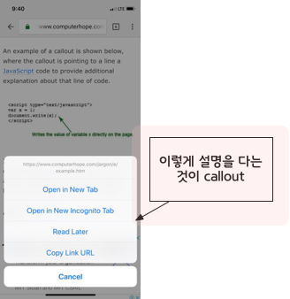
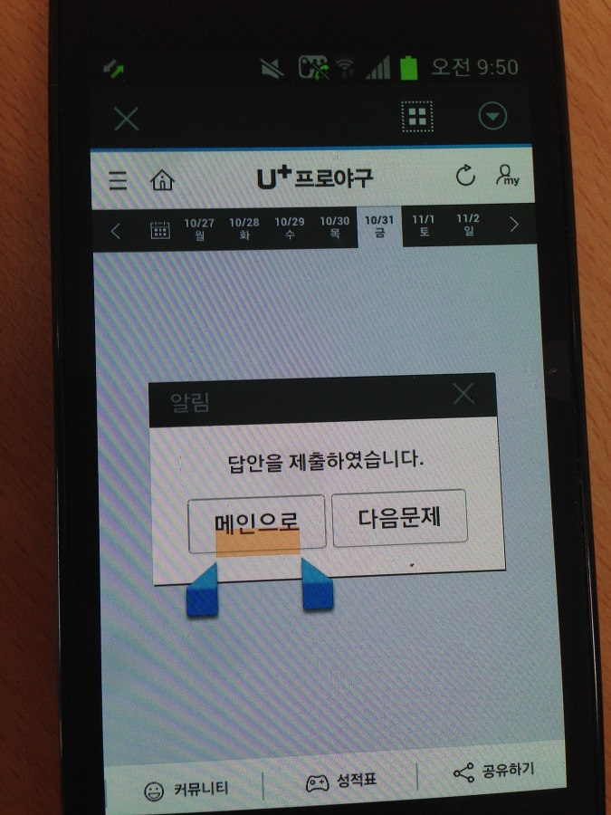

# Webkit

- MDN : [https://developer.mozilla.org/en-US/docs/Web/CSS/WebKit_Extensions](https://developer.mozilla.org/en-US/docs/Web/CSS/WebKit_Extensions)

- 애플에서 개발하는, 웹 브라우저 및 운영 체제에서도 쓰이는 레이아웃 엔진의 일종

    - (렌더링/레이아웃) 엔진 ? 내용 정보인 HTML, XML 서식정보인 CSS 등을 읽어들여 사람이 눈으로 읽고 볼 수 있는 문서로 표시하는 웹 브라우저의 핵심 기능을 담당한다. 코드를 호출시에 읽고 해석한다는 점에서 인터프리터라고 할 수 있다.

        - 게코, 서보, 웹키트, 블링크, 프레스토, EdgeHTML, 등등 많다.

- 웹 브라우저를 만드는데 기반을 제공하는 오픈소스 응용 프로그램 프레임 워크이다.

- MAC OS10의 사파리 웹 브라우저 엔진으로 사용하기위해 컨커리 브라우저의 KHTML 소프트웨어 라이브러리에서 가져온 것이었으나, 지금은 구글의 안드로이드 등 플랫폼에 사용되고 있다.

- 단점 : 유독 폼 요소의 디자인이 타 브라우저와 따로 노는 경우가 많아서 CSS에서 변경해줘야 할 것들이 있다.

## 구성 요소

- 웹 코어(WebCore): HTML, SVG를 위한 레이아웃, 랜더링, [DOM](https://ko.wikipedia.org/wiki/DOM) [라이브러리](https://ko.wikipedia.org/wiki/
%EB%9D%BC%EC%9D%B4%EB%B8%8C%EB%9F%AC%EB%A6%AC)로 초기에는 애플사가, 지금은 웹킷 프로젝트가 개발하고 있다. [LGPL](https://ko.wikipedia.org/wiki/LGPL) 하에서 라이선스되고 있다.

- 자바스크립트코어(JavaScriptCore): 웹킷 기능을 위한 [자바스크립트 코드](https://ko.wikipedia.org/wiki/%EC%9E%90%EB%B0%94%EC%8A%A4%ED%81%AC%EB%A6%BD%ED%8A%B8)를 제공하며 맥 오에스 텐 안의 다른 환경에서 이러한 종류의 스크립팅을 제공한다.

- 드로세라(Drosera): 웹킷 순수 빌드에 포함되어 있는 자바스크립트 [디버거](https://ko.wikipedia.org/wiki/%EB%94%94%EB%B2%84%EA%B1%B0)이다.

- 브라우저 : Safari, Chrome, Android, iOS, Webkit 엔진을 이용하는 브라우저
 
## Webkit CSS

### -webkit-text-security

- 비밀번호 입력 등 텍스트를 보여주고 싶지 않을 때, 이미지로 보이도록 바꿔준다.

```
-webkit-text-security: circle;
-webkit-text-security: disc;
-webkit-text-security: square;
-webkit-text-security: none;
```

- [참고](https://ithub.tistory.com/248)

### webkit-focus-ring-color

```
input[type=”text”], input[type=”email”], input[type=”password”]{
    &:focus {
        outline: -webkit-focus-ring-color auto 5px;
    }
}
```

- [참고](https://techgrafitti.wordpress.com/2015/10/26/css-override-defaults-webkit-focus-ring-color/)

### -webkit-tap-highlight-color
    
- iOS와 안드로이드의 웹 킷 기반 브라우저 (사파리,크롬 등) 에서 링크를 터치하면 해당 위치를 표시하는 하이라이트가 나타난다. 이 하이라이트의 색상을 바꾸고 싶을 때 사용할 수 있는 것이다.

- tab, link, focus 가 맞춰졌을 때 나타나는 색상을 결정한다.

- 아이폰에서는 사각형 박스 형태로 표시되고, 안드로이드에선 주황색 테두리가 표시된다.

```
-webkit-tap-highlight-color:<color>;
```

- 화면을 터치했을 때, 특정 액션이 일어나도록 처리하고 할 때, iOS 웹킷에서는 터치할 때마다 hover 효과처럼 터치하이라이트가 보인다. 이 것을 없애고 없애고 싶으면 opacity:0을 하면 된다. 또는 transparent;

### webkit-overflow-scrolling 

- 해당 요소가 터치 단말기에서 모멘텀 기반 스크롤의 활성화 여부를 지정한다.

```
auto : 일반적인 스크롤 사용. 손가락을 터치 스크린에서 떼는 순간 스크롤이 멈춘다.
touch : 모멘텀 기반 스크롤을 사용. 스크롤 제스쳐가 끝나고 손가락을 터치 스크린에서 떼어도, 잠시 스크롤이 지속된다. 
```

- 호환성 : Safari-in-iOS

- 참고 : [https://developer.mozilla.org/ko/docs/Web/CSS/-webkit-overflow-scrolling](https://developer.mozilla.org/ko/docs/Web/CSS/-webkit-overflow-scrolling)

### -webkit-scrollbar

- 스크롤바 CUSTOM

```
::-webkit-scrollbar {
    width: 12px;
}
 
::-webkit-scrollbar-track {
    -webkit-box-shadow: inset 0 0 6px rgba(0,0,0,0.3); 
    border-radius: 10px;
}
 
::-webkit-scrollbar-thumb {
    border-radius: 10px;
    -webkit-box-shadow: inset 0 0 6px rgba(0,0,0,0.5); 
}
```
- [스크롤바 스타일 바꾸기](https://webisfree.com/2019-01-08/css-%EB%B8%8C%EB%9D%BC%EC%9A%B0%EC%A0%80-%EC%8A%A4%ED%81%AC%EB%A1%A4%EB%B0%94-%EC%8A%A4%ED%83%80%EC%9D%BC-%EC%A7%80%EC%A0%95-%EB%B0%94%EA%BE%B8%EB%8A%94-%EB%B0%A9%EB%B2%95-%EC%95%8C%EC%95%84%EB%B3%B4%EA%B8%B0)

### webkit-text-size-adjust

- 안드로이드와 iOS에서 사용하는 렌더링 엔진에는 기울이게 따라 문자열 크기를 자동으로 조절하는 기능이 있다. 스마트폰이 가로 모드로 전환될 때 문자가 약간 커지는 것을 보게 된다.

- 이 것을 무효로 하려면, none으로 설정한다.

- 아이폰의 경우, 뷰포트가 변경이 되면, 자동으로 폰트 크기를 조절하는데, 이걸 방지하는 속성이다.

```
-webkit-text-size-adjust:auto
// 화면의 폭에 맞게 텍스트 크기를 자동적으로 조절한다. 
// 자동적으로 조절한다는 것은, 디자이스의 렌더링이 다르면 다르게 렌더링 되는 것이므로 추천하는 방식은 아니다.

-webkit-text-size-adjust: none
// 텍스트의 크기를 자동으로 조절하지 말라는 뜻이다.
// 일반적으로 body에 폰트크기를 설정하고, 미디어쿼리를 사용하여 좀 더 세밀하게 조절해서 사용하고 
// 위의 속성을 사용하여 조절하지 못하게 한다.

-webkit-text-size-adjust: 100%
// 폰트 크기를 명시적으로 지정해주는 것이다.
// 명시적으로 100%를 주어, 모든 디바이스에서 동일하게 보여주는 방식이다.
```

### webkit-touch-callout

- iOS의 웹 뷰에서 링크를 오래 누르면, 팝업 메뉴가 표시된다. 이를 막기 위해서 none 속성을 지정한다.

- 즉, 팝업창 차단하기

- 


```
-webkit-touch-callout: none;
```

### webkit-touch-select: none;

- 일반 앱에서는 버튼이나 툴바에 있는 문자는 선택할 수 없다. 하이브리드 앱에서 그런 부분의 문자를 사용자가 선택해서 복사할 수 있게 하려면, 이 또한 앱을 웹 사이트처럼 보이게 만든다. 문자를 선택할 수 없게 만들려면 none을 지정한다.

- 

- 즉, 복사 막기

```
-webkit-touch-select: none;
```

### webkit-user-select

- 사용자가 요소를 선택할 수 없게 하여 드래그, 더블클릭, 블럭 지정을 막는다.

```
user-select: none 
-webkit-user-select: none;
```

### -webkit-appearance

- 운영체제 및 브라우저에 기본적으로 설정되어 있는 테마를 기반으로 요소를 표현한다. 즉, 네이티브로 지원되는 모양을 해제하거나 추가할 때 이 속성을 사용한다.

- 체크 박스의 모양이 라운드로 되거나 셀렉트 박스에 그림자가 지니는 경우가 있다.

- 예

    - input 요소 표시로 폼 요소의 디바이스 기반 스타일을 없앤다.

    - iOS 폼 요소들에 부여되어 있는 둥근 테두리 값이나 그림자 효과를 제거할 때 사용할 수 있다.
    
    - webkit 계열의 브라우저 type="search" 필드의 둥근 테두리 값이나 reset 효과를 나타내는 버튼을 삭제하는 데 사용할 수 있다.
    
    - select 필드의 기본 화살표 모양을 삭제하거나 대체할 수 있다.

- [참고](https://developer.mozilla.org/en-US/docs/Web/CSS/appearance)

```
-moz-appearance: none;
-webkit-appearance: none;

-moz-appearance: button;
-webkit-appearance: button;

-moz-appearance: checkbox;
-webkit-appearance: checkbox;

-moz-appearance: radio;
-webkit-appearance: radio;

/* 속성 값 */
    checkbox
    radio
    push-button
    square-button
    button
    button-bevel
    listbox
    listitem
    menulist
    menulist-button
    menulist-text
    menulist-textfield
    scrollbarbutton-up
    scrollbarbutton-down
    scrollbarbutton-left
    scrollbarbutton-right
    scrollbartrack-horizontal
    scrollbartrack-vertical
    scrollbarthumb-horizontal
    scrollbarthumb-vertical
    scrollbargripper-horizontal
    scrollbargripper-vertical
    slider-horizontal
    slider-vertical
    sliderthumb-horizontal
    sliderthumb-vertical
    caret
    searchfield
    searchfield-decoration
    searchfield-results-decoration
    searchfield-results-button
    searchfield-cancel-button
    textfield
    textarea
```
        
### display: -webkit-box

- 블록을 임의의 배치 순서로 변경할 수 있게 해줌

### -webkit-line-clamp 

- 라인 수 지정

- 지원하지 않는 브라우저에서는 아래와 같이 사용

```
overflow: hidden;
text-overflow: ellipsis;
display: block /* fallback for non-webkit */
display: -webkit-box;
-webkit-line-clamp: 3;
-webkit-box-orient: vertical;
line-height: 20px;

height: 60px; /* fallback for non-webkit */

//height = line-height * -webkit-line-clamp 으로 설정
```
- [참고](https://fullest-sway.me/blog/2017/01/30/css-multiline_ellipsis/)

### -webkit-box-orient

- 박스의 흐름의 방향을 지정

```
horizontal - 상자 내용물을 가로로 배치

vertical - 상자 내용물을 세로로 배치

inline-axis - 상자는 인라인 축을 따라 자식을 표시

block-axis - 해당 자식이 블록 축을 따라 표시

inherit

initial

unset
```